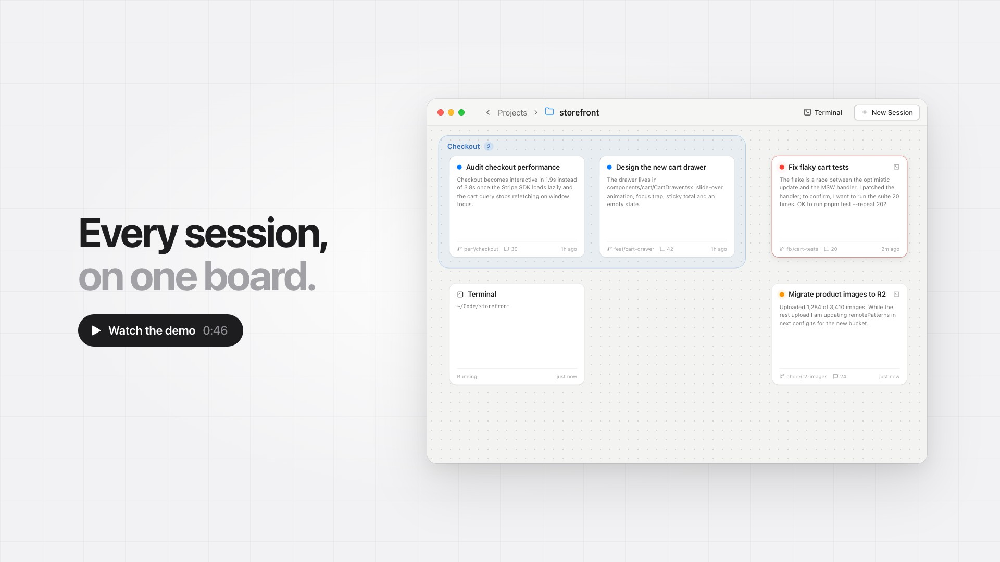

<div align="center">


# Claude Nodes

**A spatial board for your Claude Code sessions.**

See every session in a repo at once, spot the ones waiting on you,<br>
and start new sessions from the context of old ones.

<br>

<a href="docs/demo.mp4">
  
</a>

</div>

## Why

Run a few Claude Code sessions in parallel and the terminal tabs pile up. One has been waiting on a permission prompt for ten minutes, and yesterday's useful context is stuck in a transcript you'll never reopen.

Claude Nodes puts each session on a canvas as a card. Click a card to open the real `claude` terminal. Select a few cards to start a new session that already knows what they did.

<picture>
  <source media="(prefers-color-scheme: dark)" srcset="docs/screenshots/board-dark.png">
  
</picture>

## Features

- **One card per session.** Each card shows Claude's latest reply, the branch and the last activity. Arrange cards however you like and group them into sections.
- **Live status.** 🟠 working · 🔴 needs you · 🔵 done. It comes from Claude Code hooks, so it's exact, not guessed.
- **The real terminal.** Click a card to open the actual `claude` TUI. Close it and the session keeps running.
- **Plain terminals.** Press **T** for a shell in the project folder, right on the board.
- **New session from context.** Select a few cards and start a session from their handoff summaries. The originals are never touched.
- **An archive you can search.** Old sessions stack up in one pile, and dropping a card on it stops its process. Click the stack to browse, or hover it and type to search. Drag a card out to pick it up again.

<picture>
  <source media="(prefers-color-scheme: dark)" srcset="docs/screenshots/merge-dark.png">
  
</picture>

## Get started

You need macOS, [Node.js](https://nodejs.org) 22 or newer, [pnpm](https://pnpm.io), and [Claude Code](https://code.claude.com/docs/en/overview) signed in with `claude` on your `PATH`.

```sh
pnpm install
pnpm dev
```

1. Click **New Project** (or drop a folder on the window) and pick a repo.
2. Open it. Sessions you've already run there appear in the archive.
3. Press **N** for a new session, or drag a card out of the archive to resume it.

To get a standalone app instead, run `pnpm dist` and drag `dist/mac-arm64/Claude Nodes.app` into Applications. It's signed for your Mac only, and it shares its board with `pnpm dev`, so don't run both at once.

> [!NOTE]
> In a repo Claude Code hasn't opened before, the first session shows Claude's folder-trust prompt. "No, exit" is preselected, so move to "Yes" before pressing Enter.

## Shortcuts

| Action | Shortcut |
| --- | --- |
| New session · new terminal | N · T |
| Open a card | Click · Enter |
| Select cards | Drag on empty canvas · ⇧-click |
| Group the selection into a section | ⌘G |
| Archive the selection | ⌫ |
| Search the archive | Hover the stack and type |
| Close the terminal, or go back to projects | ⌘W |

<details>
<summary>All shortcuts</summary>

| Where | Action | Shortcut |
| --- | --- | --- |
| Anywhere | Add a project | ⌘⇧N |
| | Close the modal, or go back to projects | ⌘W |
| Projects | Open the selected project | Double-click · ⌘O · ⌘↓ |
| | Rename · remove | Enter · ⌘⌫ |
| | Color, Reveal in Finder | Right-click |
| Board | New session | N · ⌘N · double-click empty canvas |
| | New terminal in the project folder | T · ⌘T |
| | Open a card | Click · Enter |
| | Select | Drag on empty canvas · ⇧-click · ⌘-click · ⌘A (all active) |
| | Group the selection into a section | ⌘G |
| | Archive the selection | ⌫ |
| | Search the archive | Hover the stack and type · Esc |
| | Rename a card | Double-click its title |
| | Pan · zoom | Two-finger scroll, Space-drag or middle-drag · pinch |
| Terminal | Newline in Claude's prompt | ⇧Enter |
| | Clear · copy · select all | ⌘K · ⌘C · ⌘A |
| New session from context | Start | ⌘Enter |

In the terminal, Esc goes to Claude (it interrupts a turn), so it never closes the modal. ⌘W never closes the window.

</details>

## How it works

Each card is an ordinary Claude Code session, so you can resume it from any terminal later and your own settings, hooks and MCP servers still apply. Status comes from hooks the app adds to its own `claude` processes.

Everything stays on your machine. The app reads transcripts where Claude Code keeps them and stores only the board layout in `~/Library/Application Support/Claude Nodes/state.json`. *New session from context* makes one Claude request per selected session, which counts toward your usage like any other prompt.

For the architecture, the hook-to-status mapping and the code layout, see [How it works](docs/how-it-works.md).

## Known limitations

- Status is tracked only for sessions started from the app. A session running in another terminal shows as done.
- Running `/clear` inside a card starts a new session id, which shows up as a new archived card.
- Built and tested on macOS only.

## Development

```sh
pnpm dev          # run with hot reload
pnpm build        # production build into out/
pnpm start        # run the production build
pnpm typecheck    # type-check main, preload and renderer
pnpm dist         # build Claude Nodes.app into dist/
```

`CLAUDE_NODES_USER_DATA=/some/dir pnpm dev` keeps app state separate from your real board, which is useful for testing.

<details>
<summary>Troubleshooting installs</summary>

- **Wrong Node version.** Node 20 breaks Electron's installer and makes pnpm skip Vite's native binding. If a build fails with "Cannot find native binding", switch to Node 22 and run `rm -rf node_modules && pnpm install`.
- **`posix_spawnp failed`.** pnpm drops the execute bit on node-pty's `spawn-helper`. `scripts/postinstall.cjs` restores it, and also downloads Electron's binary, because pnpm 10 skips dependency build scripts. Run `pnpm install` again if either step was skipped.

</details>
