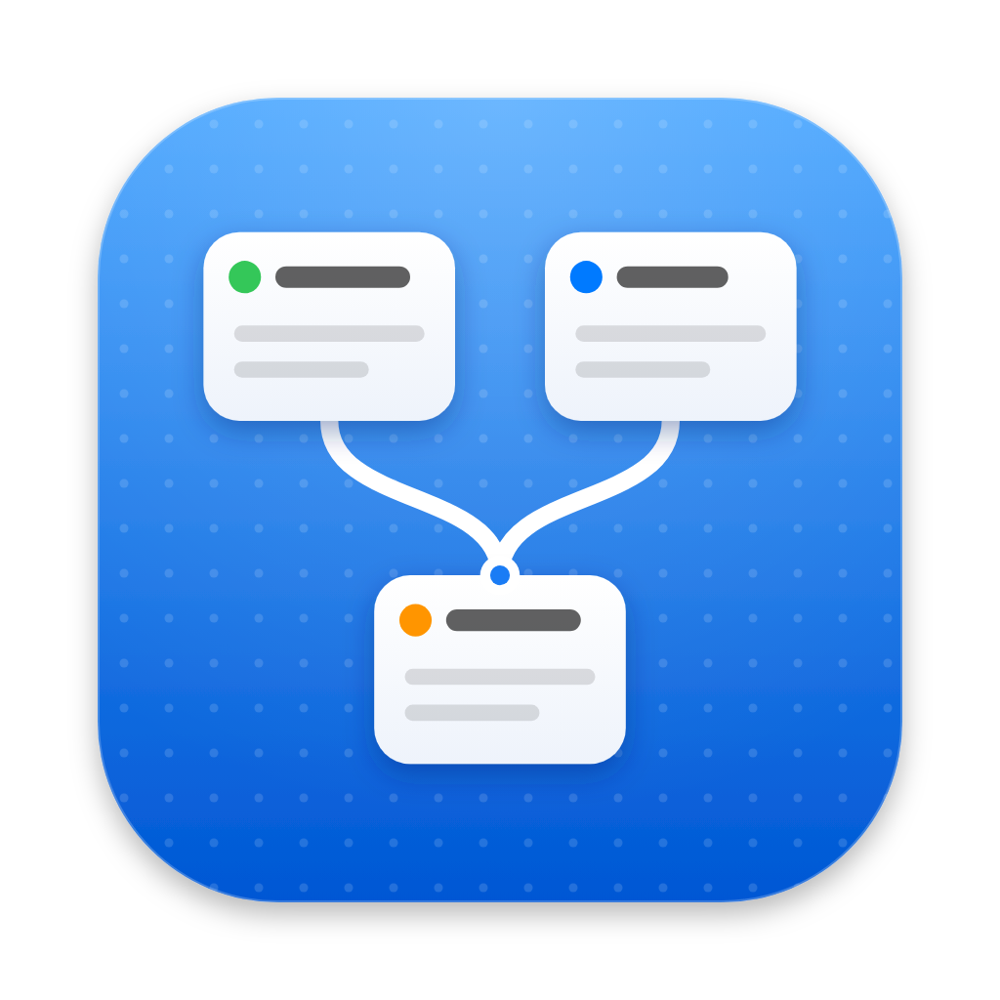

<div align="center">



# Claude Nodes

**A spatial board for your Claude Code sessions.**

See every session in a repo at once, spot the ones waiting on you,<br>
and start new sessions from the context of old ones.

</div>

https://github.com/user-attachments/assets/cbbd89ac-9096-4cfe-8c6a-4f6a73e9c7f8

## Features

- **A card per session** with Claude's latest reply, the branch and the last activity. Arrange cards and group them into sections.
- **Live status** from Claude Code hooks: 🟠 working · 🔴 needs you · 🔵 done.
- **The real terminal.** Click a card to open the actual `claude` TUI, or press **T** for a shell in the project folder.
- **New session from context.** Select a few cards and start a session that already knows what they did.
- **A searchable archive.** Old sessions stack up in one pile. Drag a card out to pick it up again.

## Get started

You need macOS, [Node.js](https://nodejs.org) 22+, [pnpm](https://pnpm.io) and [Claude Code](https://code.claude.com/docs/en/overview) with `claude` on your `PATH`.

```sh
pnpm install
pnpm dev
```

Click **New Project**, pick a repo and open it. Press **N** for a new session, or drag one out of the archive to resume it.

For a standalone app, run `pnpm dist` and move `dist/mac-arm64/Claude Nodes.app` into Applications.

## Shortcuts

| Action | Shortcut |
| --- | --- |
| New session · new terminal | N · T |
| Open a card | Click · Enter |
| Select cards | Drag on empty canvas · ⇧-click |
| Group the selection into a section | ⌘G |
| Archive the selection | ⌫ |
| Search the archive | Hover the stack and type |

## Learn more

Everything stays on your machine. The app reads transcripts where Claude Code keeps them and saves only the board layout.

[How it works](docs/how-it-works.md) covers the architecture, every shortcut, known limitations and development.
