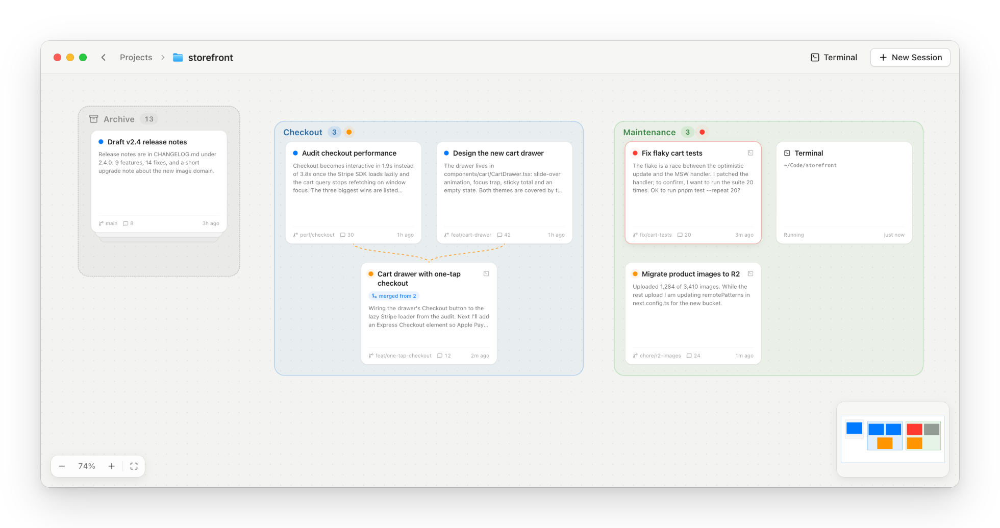
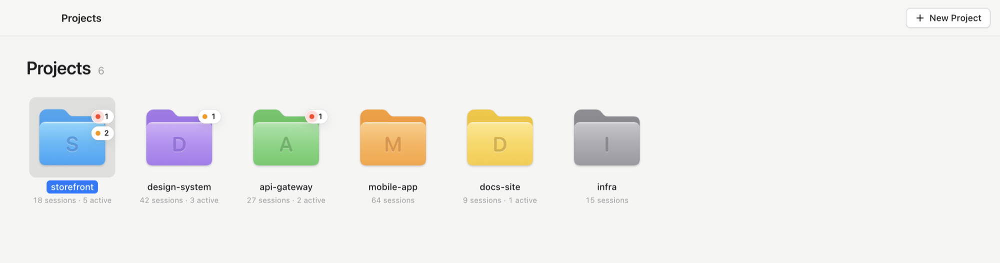
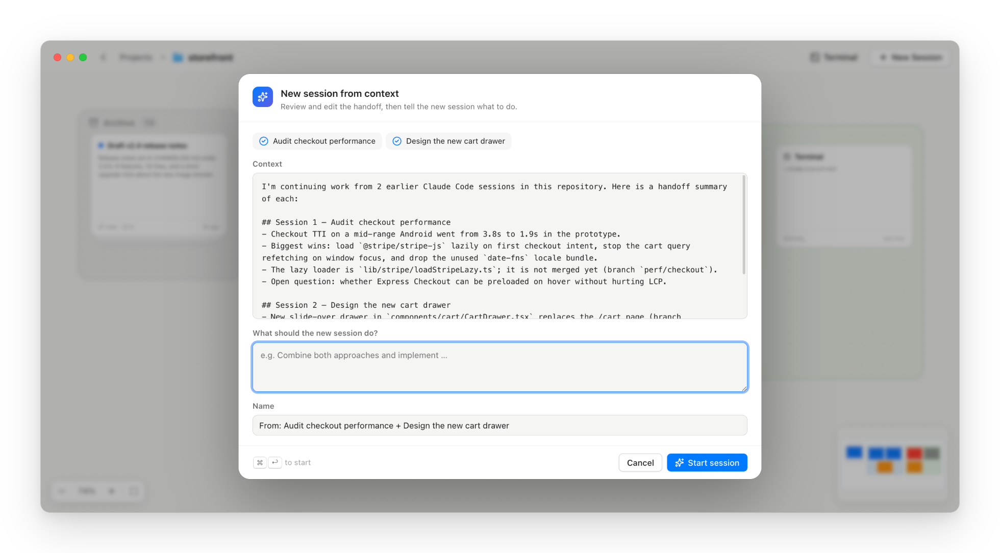
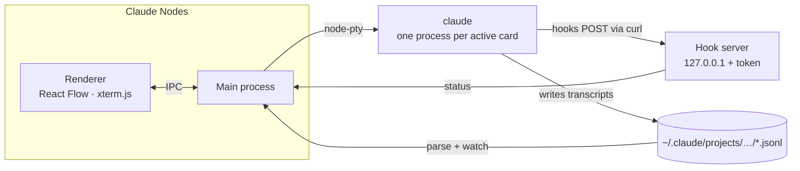

<div align="center">

# Claude Nodes

**A spatial board for your Claude Code sessions.**

See every session in a repo at once, spot the ones waiting on you,<br>
and start new sessions from the context of old ones.

<br>

<picture>
  <source media="(prefers-color-scheme: dark)" srcset="docs/screenshots/board-dark.png">
  
</picture>

</div>

## Why

Running a few Claude Code sessions in parallel gets messy fast. Terminal tabs pile up, one of them has been waiting for a permission prompt for ten minutes, and the useful context from yesterday's session is stuck in a transcript you'll never reopen.

Claude Nodes puts each session on a canvas as a card. Every card shows what Claude last said and a live status dot. Click a card to open the real `claude` terminal. Select a few cards and start a new session that already knows what they did.

## Features

**Projects as folders.** Each project is a local repo, shown as a Finder-style folder with badges for sessions that are working or waiting on you. Drop a folder on the window to add it.

<picture>
  <source media="(prefers-color-scheme: dark)" srcset="docs/screenshots/projects-dark.png">
  
</picture>

**Sessions as cards.** Open a project to see its sessions as 4:3 cards on an infinite canvas. Each card shows the title, Claude's latest reply, branch, message count and last activity. Pan, zoom, box-select and arrange them however you think about the work.

**Live status.** 🟠 working · 🔴 needs you (a permission prompt or a question) · 🔵 done. Status comes from Claude Code hooks, so it's exact, not guessed from terminal output.

**The real terminal.** Clicking an active card opens the actual `claude` TUI in a modal. Close the modal and the session keeps running in the background. Reopen it and the scrollback is still there.

**Plain terminals too.** Need a shell for a quick `git` or `npm` command? Click *Terminal* in the title bar (or press **T**) for a card running your login shell in the project folder. Terminal cards live on the board next to your sessions but never go to the archive. Remove one when you're done with it.

**An archive, not a graveyard.** Existing sessions for the repo are imported into an archive zone. Click an archived card to read its transcript, or drag it back onto the canvas to pick it up again. Drag a card into the archive to stop its process. Archived cards pile up in a single stack, most recent on top: hover it and type to fuzzy-search session titles, or click it to fan out the four most recent. Esc or a click elsewhere folds them back.

**New session from context.** Select one or more cards and choose *New session from context*. Each session writes a handoff summary in a forked, throwaway copy, so the originals are untouched. You review and edit the combined context, say what the new session should do, and it starts with all of it. Dashed lineage lines connect the new card to its sources.

<picture>
  <source media="(prefers-color-scheme: dark)" srcset="docs/screenshots/merge-dark.png">
  
</picture>

## Getting started

You need macOS, [Node.js](https://nodejs.org) 22 or newer (see `.nvmrc`), [pnpm](https://pnpm.io), and [Claude Code](https://code.claude.com/docs/en/overview) installed and signed in, with `claude` on your shell's `PATH`.

From a clone of this repo:

```sh
pnpm install
pnpm dev
```

Then:

1. Click **New Project** (or drop a folder on the window) and pick a repo.
2. Double-click the folder. Sessions you've already run in that repo appear in the archive.
3. Press **N** for a new session, or drag an archived card out to resume it.
4. Box-select a few cards and click **New session from context**.

> [!NOTE]
> The first session in a repo Claude Code hasn't opened before shows Claude's folder-trust prompt. "No, exit" is preselected, so move to "Yes" before pressing Enter.

## Keyboard and mouse

| Where | Action | Shortcut |
| --- | --- | --- |
| Anywhere | Add a project | ⌘⇧N |
| | Close the modal, or go back to projects | ⌘W |
| Projects | Open the selected project | Double-click · ⌘O · ⌘↓ |
| | Rename · remove | Enter · ⌘⌫ |
| | Color, Reveal in Finder | Right-click |
| Board | New session | N · ⌘N · double-click empty canvas |
| | New terminal in the project folder | T · ⌘T |
| | Open a card | Click · Enter |
| | Select | Drag on empty canvas · ⇧-click · ⌘-click · ⌘A (all active) |
| | Archive the selection | ⌫ |
| | Search the archive | Hover the stack and type · Esc |
| | Rename a card | Double-click its title |
| | Pan · zoom | Two-finger scroll, Space-drag or middle-drag · pinch |
| Terminal | Newline in Claude's prompt | ⇧Enter |
| | Clear · copy · select all | ⌘K · ⌘C · ⌘A |
| New session from context | Start | ⌘Enter |

In the terminal, Esc goes to Claude (it interrupts a turn), so it never closes the modal. ⌘W never closes the window.

## How it works



**Sessions** are ordinary Claude Code sessions. New cards run `claude --session-id <uuid>`, and resuming runs `claude --resume <id>`, so the same session can be continued from any terminal later. Your own settings, hooks and MCP servers still apply.

**Terminal cards** run `$SHELL -l` in the repo folder with your login-shell environment. They get no hooks and have no transcript, so they have no status dot. A terminal whose shell has exited starts a fresh shell when you reopen it.

**Status** comes from hooks that the app adds for its own processes with `--settings`. Each hook POSTs its payload to a token-protected server on 127.0.0.1:

| Hook | Status |
| --- | --- |
| `UserPromptSubmit`, `PreToolUse`, `PostToolUse` | 🟠 Working |
| `PermissionRequest`, `Notification` (permission or question), `PreToolUse` for `AskUserQuestion` | 🔴 Needs you |
| `Stop`, `SessionEnd`, process exit | 🔵 Done |

Interrupting with Esc or Ctrl+C doesn't fire a hook, so the app watches for those keystrokes as well.

**Cards** are read from Claude Code's transcripts in `~/.claude/projects/<encoded-repo-path>/`. Titles use your custom title first, then Claude's generated title, then the first prompt. Parsing is incremental and cached, so large histories load quickly.

**New session from context** runs `claude -p --resume <id> --fork-session --no-session-persistence` for each selected session, at most three at a time. The fork writes the summary and is then thrown away, so the original session is never touched. The combined handoff becomes the new session's first prompt.

### Your data

Everything stays on your machine. Transcripts stay where Claude Code keeps them. The app stores only board layout (projects, card positions, archive, custom titles and lineage) in `~/Library/Application Support/Claude Nodes/state.json`. *Remove from board* hides a card and never deletes a transcript.

*New session from context* makes one Claude request per selected session, so it counts toward your Claude usage like any other prompt.

## Known limitations

- Status is tracked only for sessions started from the app. A session running in another terminal shows as done.
- Running `/clear` inside a card starts a new session id, which shows up as a new archived card.
- Built and tested on macOS only.

## Development

```sh
pnpm dev          # run with hot reload
pnpm build        # production build into out/
pnpm start        # run the production build
pnpm typecheck    # type-check main, preload and renderer
```

`CLAUDE_NODES_USER_DATA=/some/dir pnpm dev` keeps app state separate from your real board, which is useful for testing.

```
src/
  shared/       types.ts + api.ts: the typed IPC contract (window.api)
  preload/      contextBridge implementation of the contract
  main/         Electron main process
    env.ts        login-shell environment and claude binary lookup
    discovery.ts  parses transcripts into card metadata and watches for changes
    board.ts      merges sessions on disk with the saved board; archive layout
    pty.ts        node-pty processes and the output buffer replayed into terminals
    hooks.ts      localhost hook server and the status machine
    summarize.ts  forked, non-persisted handoff summaries
    store.ts      state.json in the app's userData directory
  renderer/src/
    views/        ProjectsView (folders) and BoardView (canvas)
    components/   title bar, folder icon, board cards, archive zone, merge dialog, lineage edges
    terminal/     xterm.js registry, TerminalModal, TranscriptPreview
```

Built with Electron, electron-vite, React, TypeScript, [React Flow](https://reactflow.dev), [xterm.js](https://xtermjs.org), [node-pty](https://github.com/microsoft/node-pty) and zustand.

<details>
<summary>Troubleshooting installs</summary>

- **Wrong Node version.** Node 20 breaks Electron's installer and makes pnpm skip Vite's native binding. If a build fails with "Cannot find native binding", switch to Node 22 and run `rm -rf node_modules && pnpm install`.
- **`posix_spawnp failed`.** pnpm drops the execute bit on node-pty's `spawn-helper`. `scripts/postinstall.cjs` restores it, and also downloads Electron's binary, because pnpm 10 skips dependency build scripts. Run `pnpm install` again if either step was skipped.

</details>
