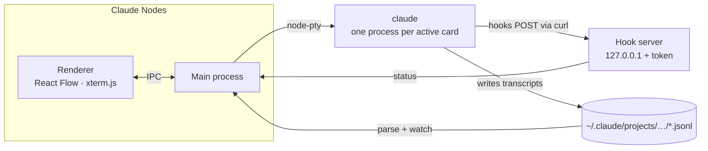

# How Claude Nodes works

The details behind the [README](../README.md): what the app runs, where status comes from, every shortcut, and how to work on the code.



## Sessions

Sessions are ordinary Claude Code sessions. New cards run `claude --session-id <uuid>`, and resuming runs `claude --resume <id>`, so you can continue the same session from any terminal later. Your own settings, hooks and MCP servers still apply.

## Terminal cards

Terminal cards run `$SHELL -l` in the repo folder with your login-shell environment. They get no hooks and have no transcript, so they have no status dot. A terminal whose shell has exited starts a fresh shell when you reopen it.

## Expanded cards

A card can expand in place to show its terminal on the board, so you can watch several sessions at once. It's the same terminal as the modal's, so moving between the two keeps the screen. Drag a card's edges or corners to resize it. The board saves each card's size and whether it's expanded. After a restart, an expanded card waits for you to click **Resume session** or **Start shell** before it starts anything.

## Status

Status comes from hooks that the app adds for its own processes with `--settings`. Each hook POSTs its payload to a token-protected server on 127.0.0.1:

| Hook | Status |
| --- | --- |
| `UserPromptSubmit`, `PreToolUse`, `PostToolUse` | 🟠 Working |
| `PermissionRequest`, `Notification` (permission or question), `PreToolUse` for `AskUserQuestion` | 🔴 Needs you |
| `Stop`, `SessionEnd`, process exit | 🔵 Done |

Interrupting with Esc or Ctrl+C doesn't fire a hook, so the app watches for those keystrokes as well.

## Cards

Cards are read from Claude Code's transcripts in `~/.claude/projects/<encoded-repo-path>/`. Titles use your custom title first, then Claude's generated title, then the first prompt. Parsing is incremental and cached, so large histories load quickly.

## New session from context

For each selected session the app runs `claude -p --resume <id> --fork-session --no-session-persistence`, at most three at a time. The fork writes a handoff summary and is then thrown away, so the original session is never touched. You review and edit the combined summaries, and they become the new session's first prompt.

This makes one Claude request per selected session, so it counts toward your Claude usage like any other prompt.

## Your data

Transcripts stay where Claude Code keeps them. The app stores only the board layout (projects, card positions, sections, archive, custom titles and lineage) and its settings (theme) in `~/Library/Application Support/Claude Nodes/state.json`. *Remove from board* hides a card and never deletes a transcript.

## Shortcuts

| Where | Action | Shortcut |
| --- | --- | --- |
| Anywhere | Add a project | ⌘⇧N |
| | Settings (theme: System, Light or Dark) | ⌘, · gear in the title bar |
| | Close the modal, or go back to projects | ⌘W |
| Projects | Open the selected project | Double-click · ⌘O · ⌘↓ |
| | Rename · remove | Enter · ⌘⌫ |
| | Color, Reveal in Finder | Right-click |
| Board | New session | N · ⌘N · double-click empty canvas |
| | New terminal in the project folder | T · ⌘T |
| | Open a card | Click · Enter |
| | Expand a card on the board, or collapse it | E · the card's ⤢ button |
| | Resize an expanded card | Drag its edges or corners |
| | Select | Drag on empty canvas · ⇧-click · ⌘-click · ⌘A (all active) |
| | Group the selection into a section | ⌘G |
| | Archive the selection | ⌫ |
| | Search the archive | Hover the stack and type · Esc |
| | Rename a card | Double-click its title |
| | Pan · zoom | Two-finger scroll, Space-drag or middle-drag · pinch |
| Terminal | Newline in Claude's prompt | ⇧Enter |
| | Clear · copy · select all | ⌘K · ⌘C · ⌘A |
| New session from context | Start | ⌘Enter |

In the terminal, Esc goes to Claude (it interrupts a turn), so it never closes the modal. ⌘W never closes the window.

## Known limitations

- Status is tracked only for sessions started from the app. A session running in another terminal shows as done.
- Running `/clear` inside a card starts a new session id, which shows up as a new archived card.
- In a repo Claude Code hasn't opened before, the first session shows Claude's folder-trust prompt. "No, exit" is preselected, so move to "Yes" before pressing Enter.
- Built and tested on macOS only.

## Project layout

```
src/
  shared/       types.ts + api.ts: the typed IPC contract (window.api)
  preload/      contextBridge implementation of the contract
  main/         Electron main process
    env.ts        login-shell environment and claude binary lookup
    discovery.ts  parses transcripts into card metadata and watches for changes
    board.ts      merges sessions on disk with the saved board; archive layout
    pty.ts        node-pty processes and the output buffer replayed into terminals
    hooks.ts      localhost hook server and the status machine
    summarize.ts  forked, non-persisted handoff summaries
    store.ts      state.json in the app's userData directory
  renderer/src/
    views/        ProjectsView (folders) and BoardView (canvas)
    components/   title bar, folder icon, board cards, sections, archive stack, merge dialog, lineage edges
    terminal/     xterm.js registry, TerminalModal, TranscriptPreview
```

Built with Electron, electron-vite, React, TypeScript, [React Flow](https://reactflow.dev), [xterm.js](https://xtermjs.org), [node-pty](https://github.com/microsoft/node-pty) and zustand.

## Development

You need macOS, [Node.js](https://nodejs.org) 22+ and [pnpm](https://pnpm.io).

```sh
pnpm install
pnpm dev          # run with hot reload
pnpm build        # production build into out/
pnpm start        # run the production build
pnpm typecheck    # type-check main, preload and renderer
pnpm dist         # build the arm64 and x64 DMGs into dist/
```

`CLAUDE_NODES_USER_DATA=/some/dir pnpm dev` keeps app state separate from your real board, which is useful for testing.

`pnpm dist` writes `dist/Claude-Nodes-arm64.dmg` and `dist/Claude-Nodes-x64.dmg`, with the unpacked apps in `dist/mac-arm64/` and `dist/mac/`. The apps are ad-hoc signed and not notarized, so a downloaded copy needs **Open Anyway** in Privacy & Security on first launch. The packaged app shares its board with `pnpm dev`, so don't run both at once.

### Releasing

Pushing a `v*` tag runs `.github/workflows/release.yml`, which builds both DMGs and attaches them to the GitHub release for that tag. The README's download links point at `releases/latest/download/`, so they pick up each new release.

```sh
npm version 0.2.0       # bumps package.json, commits, tags v0.2.0
git push --follow-tags
```

The workflow fails if the tag doesn't match the version in `package.json`.

### Troubleshooting installs

- **Wrong Node version.** Node 20 breaks Electron's installer and makes pnpm skip Vite's native binding. If a build fails with "Cannot find native binding", switch to Node 22 and run `rm -rf node_modules && pnpm install`.
- **`posix_spawnp failed`.** pnpm drops the execute bit on node-pty's `spawn-helper`. `scripts/postinstall.cjs` restores it, and also downloads Electron's binary, because pnpm 10 skips dependency build scripts. Run `pnpm install` again if either step was skipped.
