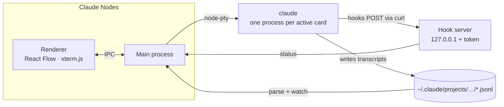

# How Claude Nodes works

The details behind the [README](../README.md): what the app runs, where status comes from, and how the code is laid out.



## Sessions

Sessions are ordinary Claude Code sessions. New cards run `claude --session-id <uuid>`, and resuming runs `claude --resume <id>`, so you can continue the same session from any terminal later. Your own settings, hooks and MCP servers still apply.

## Terminal cards

Terminal cards run `$SHELL -l` in the repo folder with your login-shell environment. They get no hooks and have no transcript, so they have no status dot. A terminal whose shell has exited starts a fresh shell when you reopen it.

## Status

Status comes from hooks that the app adds for its own processes with `--settings`. Each hook POSTs its payload to a token-protected server on 127.0.0.1:

| Hook | Status |
| --- | --- |
| `UserPromptSubmit`, `PreToolUse`, `PostToolUse` | 🟠 Working |
| `PermissionRequest`, `Notification` (permission or question), `PreToolUse` for `AskUserQuestion` | 🔴 Needs you |
| `Stop`, `SessionEnd`, process exit | 🔵 Done |

Interrupting with Esc or Ctrl+C doesn't fire a hook, so the app watches for those keystrokes as well.

## Cards

Cards are read from Claude Code's transcripts in `~/.claude/projects/<encoded-repo-path>/`. Titles use your custom title first, then Claude's generated title, then the first prompt. Parsing is incremental and cached, so large histories load quickly.

## New session from context

For each selected session the app runs `claude -p --resume <id> --fork-session --no-session-persistence`, at most three at a time. The fork writes a handoff summary and is then thrown away, so the original session is never touched. You review and edit the combined summaries, and they become the new session's first prompt.

This makes one Claude request per selected session, so it counts toward your Claude usage like any other prompt.

## Your data

Transcripts stay where Claude Code keeps them. The app stores only the board layout (projects, card positions, sections, archive, custom titles and lineage) in `~/Library/Application Support/Claude Nodes/state.json`. *Remove from board* hides a card and never deletes a transcript.

## Project layout

```
src/
  shared/       types.ts + api.ts: the typed IPC contract (window.api)
  preload/      contextBridge implementation of the contract
  main/         Electron main process
    env.ts        login-shell environment and claude binary lookup
    discovery.ts  parses transcripts into card metadata and watches for changes
    board.ts      merges sessions on disk with the saved board; archive layout
    pty.ts        node-pty processes and the output buffer replayed into terminals
    hooks.ts      localhost hook server and the status machine
    summarize.ts  forked, non-persisted handoff summaries
    store.ts      state.json in the app's userData directory
  renderer/src/
    views/        ProjectsView (folders) and BoardView (canvas)
    components/   title bar, folder icon, board cards, sections, archive stack, merge dialog, lineage edges
    terminal/     xterm.js registry, TerminalModal, TranscriptPreview
```

Built with Electron, electron-vite, React, TypeScript, [React Flow](https://reactflow.dev), [xterm.js](https://xtermjs.org), [node-pty](https://github.com/microsoft/node-pty) and zustand.
